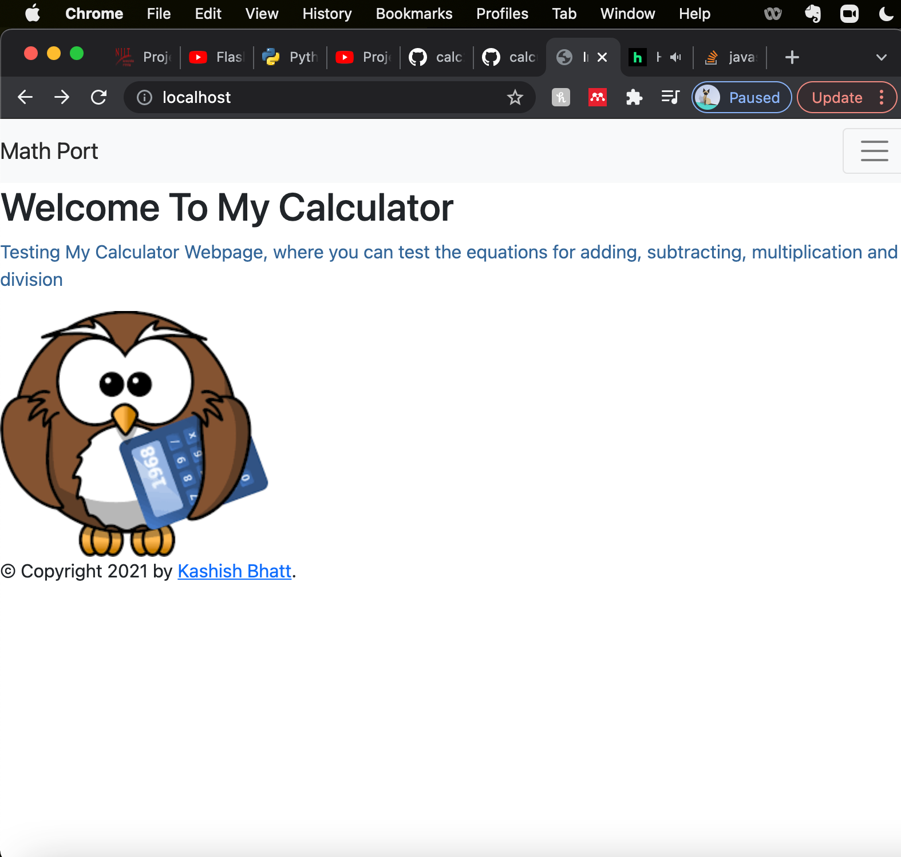
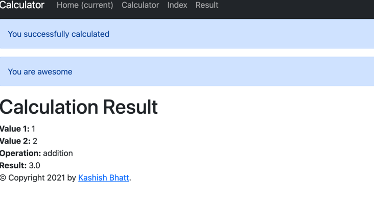
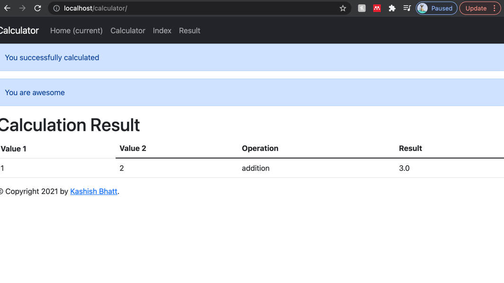
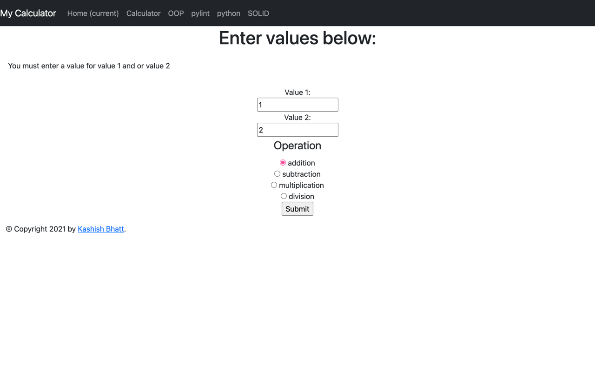
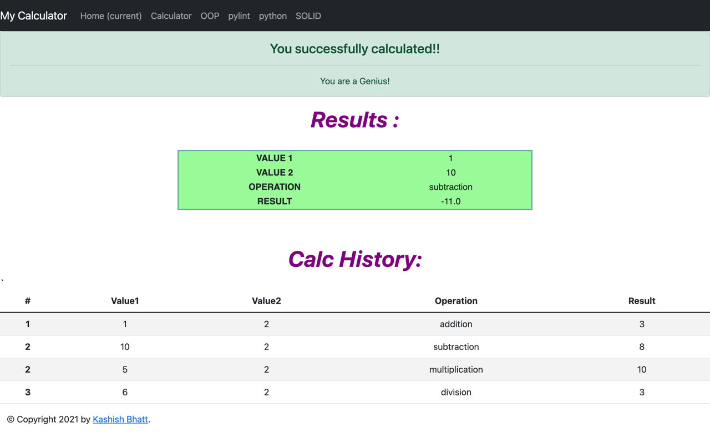
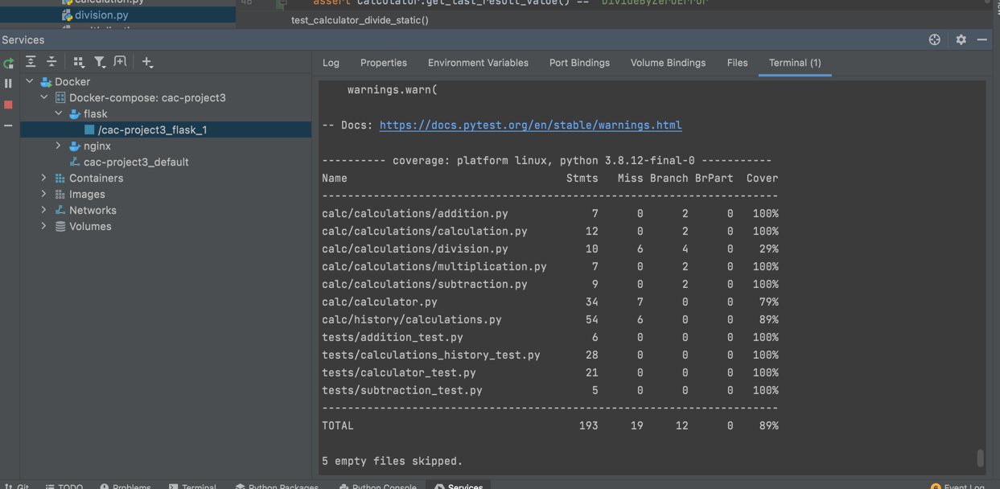
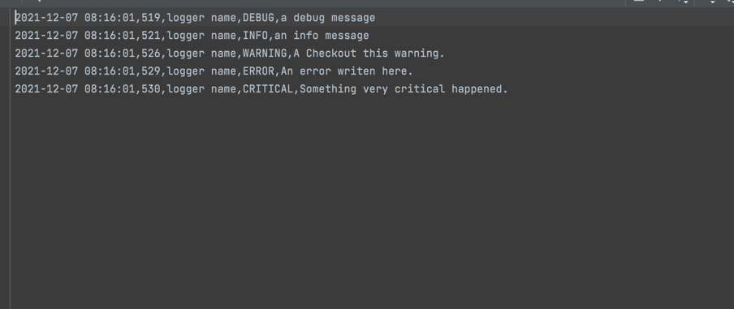

# Calculator Project Setup
[
Run Pip Install
pip install -r requirements.txt

To run tests, Lint, and Coverage report use this command:

pytest  --pylint --cov

.pylintrc is the config for pylint
.coveragerc is the config for coverage
setup.py is a config file for pytest

 
 

Beautiful Table: 

Calculator (Error):

Calculator History and Results:

Unit Test: 

Log:

Video Recording: 
https://www.youtube.com/watch?v=sXwxbN9WR6I